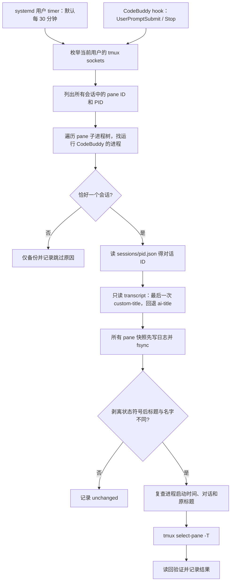
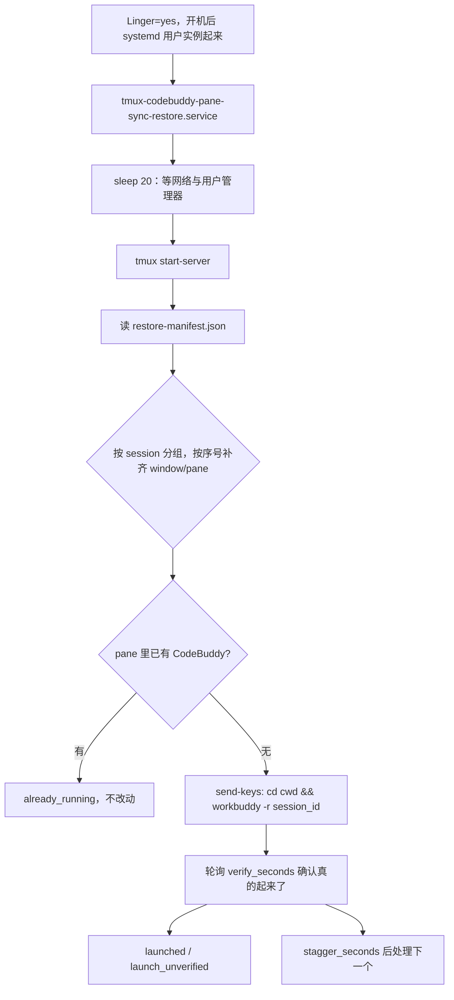

# 工作原理与取舍

## 问题

tmux pane title、CodeBuddy 保存的对话名、终端客户端显示的标签是不同状态。客户端重连或
CodeBuddy 自己输出终端标题序列时，标签可能变成自动生成的英文标题，让多个任务难以区分。

本项目以 **CodeBuddy 保存的对话名**为同步来源，定期把它写到 **tmux 服务端 pane title**，
并在写入前保留两者的快照。

## 数据路径

## 与 Codex 版本的关键差异

| 项 | tmux-codex-pane-sync | 本项目 |
|---|---|---|
| pane → 对话 | 遍历 `/proc/PID/fd`，找进程打开的 rollout `.jsonl` | `~/.codebuddy/sessions/<pid>.json` 按 pid 直接索引 |
| 名字来源 | SQLite `state_N.sqlite` 的 `threads.name`，旧版回退 `session_index.jsonl` | transcript 的 `custom-title` → `customTitle`，回退 `ai-title` → `aiTitle` |
| 需要 SQLite | 是 | 否，纯文本 JSONL |

CodeBuddy **不会**持有 transcript 文件句柄：实测运行中的 CodeBuddy 进程没有任何
`~/.codebuddy/*.jsonl` 的 fd。因此 Codex 版本基于 `/proc/PID/fd` 的发现方式在 CodeBuddy 上
永远只能得到 `no_transcript`，必须换成 `sessions/<pid>.json` 映射。

这个映射同时也更可靠：每个 CodeBuddy 会话在启动时写一份 `<pid>.json`，内含 `sessionId`、
`cwd`、`kind` 和周期刷新的 `lastHeartbeat`，而 CodeBuddy 进程就是 pane shell 的直接子进程。

## 为什么比较前要剥离状态符号

CodeBuddy 会把 `✳`、`⠴`、`⠇`、`⣾` 等状态/转轮符号写在自己渲染的标题前面，并与标题一起进入
`pane_title`。若按字面比较：

- 我们写入 `公司法了解`；
- CodeBuddy 下一帧写回 `✳ 公司法了解`；
- 字面比较判定“不同”，于是每轮都重写 → 与 CodeBuddy 的渲染互相覆盖，日志被 `updated` 刷满。

所以比较时先剥掉**前导**状态符号与空白，再判断是否 `unchanged`。剥离只用于比较，
**永远不会**把剥离后的形式写进标题。代价是：若某对话名本身以 `●` 等符号开头，可能被误判为
一致而不改写；这是为了消除抖动而接受的取舍。

## 为什么不自动输入 /rename

`/rename` 是交互式改名入口，自动向一个正在运行的 pane 输入它会受当前 UI 和输入框状态影响。
进程关联和只读元数据查询不需要切换焦点、发送按键或打断任务，也不会触发模型调用。

不能按 cwd 或“最近修改的会话”匹配：同一个目录可以同时运行多个 CodeBuddy。工具使用进程树中
实际存在会话记录的进程；多于一个候选时保守跳过。

## 两种触发方式的分工

- **hook（`UserPromptSubmit` / `Stop`）**：改名后不必等 30 分钟。hook 从 stdin 读到
  `session_id` 后，用 `--only-session` 只同步那一个 pane。这一点很重要：不加限定时，一次运行
  会为**每个** pane 写 `backup` + `result` 两条记录并各自 `fsync`；在 20 多个 pane 的机器上，
  每轮对话两次 hook 就意味着上百次写盘与上百行日志。加上限定后稳定为 4 行。
- **timer**：兜底，并处理 CodeBuddy 之后又把标题覆盖回去的情况。

hook 永远不阻塞对话：读不到事件、脚本缺失、超时或任何异常都会被吞掉，进程始终以 0 退出且
不向 stdout 写任何内容。最后一点是硬性要求——`UserPromptSubmit` 的 stdout 会被 CodeBuddy
当作上下文加入对话。

CodeBuddy **只在启动时对 hooks 取一次快照**，所以刚刚修改 `settings.json` 之后，已经在运行的
会话不会使用新 hook：要么在新会话里生效，要么通过 `/hooks` 菜单审阅后应用。因此 timer 不仅是
兜底，也是「装完立刻对老会话生效」的唯一保证。

## 写入保证

- 独占文件锁防止同时运行的服务、hook 和手工命令互相覆盖；拿不到锁就跳过（返回 0）。
- 本轮所有快照写入成功并 `fsync` 后，才开始改名；磁盘写入失败会中止。
- 不一致才更新。写之前复查 pane PID、进程启动 ticks、对话 ID/名字、原标题。
- 名字中的 `#` 在传给 tmux 时转义为 `##`，避免 `#{...}` 被当作 format 展开；命令通过参数数组
  运行，不经 shell。
- 含 C0/C1 控制字符的名字只记录，不送入终端。
- 改名后再读取服务端标题。`verification_mismatch` 表示读回不一致，通常是 CodeBuddy 立即覆盖。

这些检查缩小了竞态窗口，但 tmux、CodeBuddy 和 transcript 之间没有跨进程事务：检查结束到真正
写入之间仍可能有状态变化。日志可用于追踪，下一轮会重新匹配。

## 怎么确定「这个 pane 打开的是哪个对话」

三种来源，可信度从高到低：

| 来源 | 为什么可信 / 为什么不可信 |
|---|---|
| `GET <url>/api/v1/sessions/live` | **权威**：进程自己回答「我现在显示哪个会话」。实测 16/16 命中，并纠正了 4 个已过期的 pid 文件。只读、无按键、无 token、不写 transcript。 |
| `~/.codebuddy/sessions/<pid>.json` 的 `sessionId` | 快，但**在 `/resume` 之后会指向进程启动时创建的那个（通常是空的）会话**。实测 pane `%35`：进程 11:41:31 启动、pid 文件写 `01a0b29a-f02f`，而屏上是被 resume 的 `01a09eb5`。 |
| pane 标题 → 名字索引反查 | 只对**进程已死**的 pane 有意义（标题还在、进程没了）；要求唯一匹配，否则不猜。 |

`CodeBuddy` **不持有 transcript 句柄**，所以 Codex 版那套 `/proc/PID/fd` 扫描在 CodeBuddy 上永远只能
得到空结果；这一点必须先验证再设计。

## 布局为什么必须记「序号」而不是 tmux 下标

第一版 manifest 记录 `#{window_index}` 和 `#{pane_index}`，几分钟后同一批 pane 的 ID 没变（仍是
`%13/%19/%39`），但下标从 `6/13` 变成了 `0/0` —— tmux 在增删窗口和 pane 时会重编号。以绝对下标做键，
重启后必然对不上。

所以 manifest 记录的是**相对位置**：窗口在 session 内的序号、pane 在窗口内的序号。
恢复时按序号补齐缺的窗口/pane，只创建缺的部分：

- 新 session 会复用 `new-session` 自带的第一个 pane（否则同一对话会在两个 pane 里各起一次 —— 这个是
  实测踩到过的 bug）。
- 已有足够 pane 就直接复用；不足才 `split-window`，多一个都不切。
- 已在跑 CodeBuddy 的 pane 一律 `already_running` 跳过，所以重复执行是幂等的。

## 重启恢复的执行链

## 日志事件

| event/status | 含义 |
|---|---|
| `run_start` | 本轮开始，包含版本、是否预览、是否限定会话 |
| `backup` | 写入前的 pane/对话名字快照 |
| `result / updated` | 已设置且读回一致 |
| `result / unchanged` | 剥离状态符号后原名字已一致 |
| `result / would_update` | 预览模式，不改名 |
| `result / verification_mismatch` | 写入后读回不一致，可能被应用立即覆盖 |
| `result / title_changed_since_backup` | 标题在备份后变化，本轮跳过 |
| `result / identity_changed` | 进程或对话在检查期间变化 |
| `result / shared_pane_already_processed` | 同一 pane 出现在多个 session 中，只处理一次 |
| `result / update_error` | 调用 tmux 失败 |
| `no_codebuddy_session` | 进程子树里没有运行 CodeBuddy 的进程 |
| `ambiguous_sessions` | 多个候选会话，不能唯一关联 |
| `no_transcript` | 找到了会话，但 transcript 文件尚不存在（新会话） |
| `unreadable_transcript` | transcript 存在但无法解码 |
| `no_saved_chat_name` | 尚无 `custom-title` 或 `ai-title`（对话还没有名字） |
| `unsafe_chat_name` | 名字含终端控制字符 |
| `inspection_error` | 检查该 pane 时 tmux 或 `/proc` 出错 |
| `socket_error` | 某个 tmux 服务端不可用 |
| `run_error` | 本轮异常终止 |
| `run_end` | 本轮结束，包含 socket 数、pane 数和各状态计数 |
| `manifest` | 刷新恢复清单，含条数、是否限定会话 |

恢复日志（`restore-log.jsonl`）的事件：

| event/status | 含义 |
|---|---|
| `run_start` / `run_end` | 本轮恢复开始/结束与计数 |
| `restore / launched` | 已发出 `-r` 且轮询确认 CodeBuddy 真的起来了 |
| `restore / launch_unverified` | 已发出命令，但超时没看到 CodeBuddy |
| `restore / already_running` | 该 pane 已有 CodeBuddy，跳过（幂等的关键） |
| `restore / would_launch` `would_create_and_launch` | 预览模式的计划 |
| `restore / duplicate_session_id` | 同一对话已被处理过，不重复启动 |
| `restore / missing_cwd` | 记录的工作目录已不存在 |
| `restore / malformed_entry` | 清单条目缺字段 |
| `restore / error` | 调用 tmux 失败 |
| `no_manifest` / `launcher_not_found` / `server_unavailable` | 无清单 / 找不到启动器 / 起不了 tmux |

## 配置与路径

`config.json` 键：`codebuddy_home`、`state_dir`、`interval_minutes`、`sockets`、
`name_source`（`auto` / `custom` / `ai`）、`hooks`。`--name-source custom` 时没有自定义名的
对话不会被改名；`auto` 才会回退到自动标题。

hook 注册是**追加式**的：安装时只在 `hooks[<event>]` 里增加一个 group，并按脚本文件名判重
（重复安装不会产生第二个副本）；卸载时只删除命令里含 `codebuddy_pane_sync_hook.py` 的条目，
空 group 和空 event 才会被清理。修改前后都会把 `settings.json` 备份到
`install-backups/<时间戳>/`，写入采用「临时文件 + `os.replace`」并保持原有权限。
